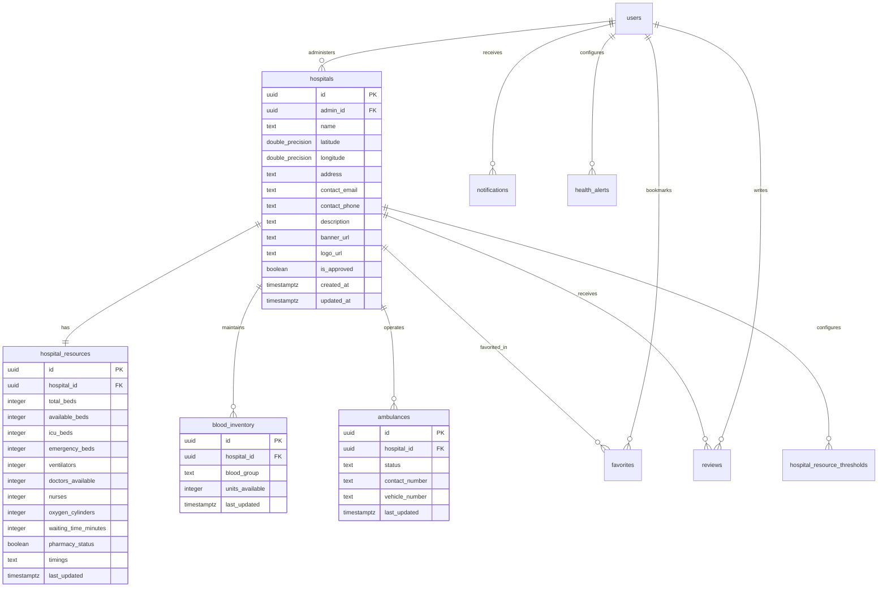
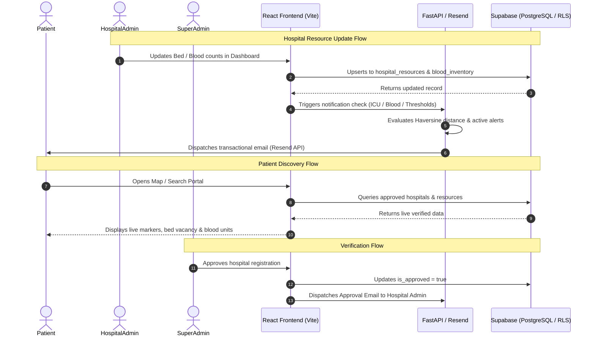

# HealthVerse
### Smart Healthcare Resource Discovery & Management Platform

[](https://react.dev/)
[](https://www.typescriptlang.org/)
[](https://vitejs.dev/)
[](https://tailwindcss.com/)
[](https://fastapi.tiangolo.com/)
[](https://supabase.com/)
[](https://leafletjs.com/)

---

## 1. Project Overview

**HealthVerse** is a centralized, role-based healthcare resource discovery and management platform designed to solve the critical problem of healthcare information asymmetry. During medical emergencies and routine healthcare searches, patients and caregivers often struggle to find immediate, accurate data regarding hospital bed vacancies, ICU capacity, oxygen availability, blood bank inventory, and emergency ambulance fleets across different healthcare providers.

HealthVerse bridges this gap by unifying hospital discovery, live resource telemetry, and spatial mapping into a single, intuitive web portal. Rather than making stressful phone calls or physically visiting multiple hospitals during critical situations, users can immediately identify verified nearby hospitals, inspect real-time resource availability, compare facilities, and configure automated email alerts for critical medical supplies.

---

## 2. Problem Statement

In the modern healthcare ecosystem, finding immediate, accurate healthcare resources is challenged by severe operational hurdles:
- **Fragmented Healthcare Information**: Hospital bed availability, blood stocks, and ambulance services are scattered across independent hospital portals or offline registers.
- **Emergency Resource Opacity**: Critical information such as ICU beds, ventilators, and emergency oxygen cylinders is rarely accessible in real time to the public.
- **Blood Availability Search Delays**: Finding specific rare or common blood groups (A+, A-, B+, B-, AB+, AB-, O+, O-) requires visiting individual blood banks.
- **Ambulance Dispatch Friction**: Lack of visibility into available emergency vehicles and direct contact lines delays triage.
- **Hospital Overcrowding**: Asymmetric data leads to overcrowding at select tertiary facilities while adjacent hospitals with available capacity remain underutilized.

---

## 3. Solution

HealthVerse provides a single source of truth for healthcare availability through a multi-tier platform connecting **Patients**, **Hospital Administrators**, and **Super Administrators**:
1. **Real-Time Resource Telemetry**: Direct hospital-level controls allowing authorized hospital administrators to update bed capacity, blood units, and staff availability with instant database synchronization.
2. **Interactive Geospatial Discovery**: An India-focused interactive map powered by OpenStreetMap and Leaflet rendering verified hospitals and real-time bed metrics based on geographic coordinates.
3. **Smart Notification Engine**: Automated transactional email alerts triggered when blood inventory is replenished or when ICU beds open up within a user-defined radius.
4. **Role-Based Security**: Complete access segmentation using Supabase Row Level Security (RLS) and JWT authentication ensuring verified hospital staff manage only their respective institutions.

---

## 4. Main Features

### 👤 Patient Portal
- **Hospital Discovery & Search**: Instant full-text search by hospital name, address, or city with multi-parameter resource filtering (Beds, ICU, Blood Group).
- **Interactive India Map**: Visual spatial explorer showing approved hospital markers with dynamic popup summaries, live availability counters, and quick navigation.
- **Comprehensive Hospital Profile (`/hospitals/:id`)**:
  - Live bed counters: Total Beds, Available Beds, ICU Beds, Emergency Beds.
  - Medical equipment & staff: Available Doctors, On-Duty Nurses, Ventilators, Oxygen Cylinders.
  - Operational metrics: Average waiting time (minutes), Pharmacy operational status (Open/Closed), Timings (e.g., 24/7).
  - Blood Bank status across all 8 major blood groups (`A+`, `A-`, `B+`, `B-`, `AB+`, `AB-`, `O+`, `O-`).
  - Ambulance fleet status (`available`, `en_route`, `offline`) and direct emergency contact numbers.
  - Verified contact information, address, and interactive location map.
- **Hospital Comparison (`/compare`)**: Side-by-side comparative analysis of multiple hospitals across critical metrics (bed availability, doctors, ICU, waiting time, pharmacy).
- **Favorites (`/favorites`)**: Bookmark frequently accessed or preferred healthcare institutions for quick monitoring.
- **HealthVerse Alerts (`/alerts`)**:
  - Create customized resource subscriptions for specific Blood Groups or ICU Beds.
  - Configurable geographic radius (5 KM, 10 KM, 25 KM, 50 KM) calculated via Haversine distance.
  - Manage active alerts (Pause, Resume, Delete).
  - Transactional email dispatch history log.

---

### 🏥 Hospital Admin Dashboard (`/dashboard/hospital`)
- **Hospital Profile Controls**: Manage hospital name, contact email, phone number, address, geographic coordinates, and description.
- **Media Management**: Upload and update hospital banner and logo graphics.
- **Real-Time Bed & Resource Editor**:
  - Update Total Beds, Available Beds, ICU Beds, and Emergency Beds.
  - Update Ventilators, Oxygen Cylinders, Doctor and Nurse counts.
  - Update Waiting Time and toggle Pharmacy operational status.
- **Blood Bank Inventory Management**: Dedicated controls to update unit counts for all 8 blood groups (`A+`, `A-`, `B+`, `B-`, `AB+`, `AB-`, `O+`, `O-`) with database upserts.
- **Ambulance Fleet Dispatch**: Register new ambulance vehicles, update status (`available`, `en_route`, `offline`), and delete decommissioned units.
- **Low-Resource Alert Settings**: Configure custom low-capacity thresholds (e.g., ICU beds $\le 2$) to receive proactive administrative warning emails.

---

### 👑 Super Admin Dashboard (`/dashboard/superadmin`)
- **Hospital Governance & Verification**: Review incoming hospital registrations with one-click **Approve** and **Reject** controls.
- **Hospital Registry & Creation**: Register new healthcare institutions, set geographic coordinates, and link designated Hospital Administrators.
- **Platform Analytics**: Real-time aggregated statistics tracking Total Hospitals, Pending Approvals, Total System Beds, and Total Registered Users.
- **Live Audit Activity Log**: Chronological audit trail logging hospital creation, approvals, and resource updates.

---

## 5. Map Integration

HealthVerse features an integrated mapping module built on **Leaflet** and **OpenStreetMap**:
- **India-Centered Geospatial View**: Initialized with geographic coordinates centered over India (`[20.5937, 78.9629]`) with responsive zoom and pan constraints.
- **Database-Driven Hospital Coordinates**: Hospital markers are dynamically rendered using precise `latitude` and `longitude` stored in Supabase.
- **Interactive Marker Popups**: Clicking a marker displays a glassmorphic card with hospital banner, name, address, available bed counts, ICU indicators, and a direct button to the full hospital profile.
- **Approved Hospital Filtering**: Public map views strictly render verified institutions (`is_approved = true`), protecting users from unverified listings.

---

## 6. Authentication & Authorization

HealthVerse enforces strict role-based access control (RBAC) powered by **Supabase Auth**:

| Role | Access Permissions | Primary Landing |
| :--- | :--- | :--- |
| **Patient** | Public discovery, search, map, hospital profile, comparison, favorites, alert creation | `/dashboard/patient` |
| **Hospital Admin** | Manage and update resources, blood inventory, ambulance fleet, and profile for linked hospital | `/dashboard/hospital` |
| **Super Admin** | Create hospitals, approve/reject registrations, assign administrators, view global analytics and audit logs | `/dashboard/superadmin` |

- **Protected Routes**: Client-side route guards in React Router prevent unauthorized access across user roles.
- **Row Level Security (RLS)**: PostgreSQL-level security policies verify authentication tokens for every mutation.

---

## 7. Technology Stack

### Frontend
- **React 19** (`react`, `react-dom`): Component-based UI library with modern hooks.
- **TypeScript 6** (`typescript`): Static typing and end-to-end interface safety.
- **Vite 8** (`vite`): Next-generation build tool and fast development server.
- **Tailwind CSS 4** (`tailwindcss`): Utility-first styling with custom glassmorphism and theme variables.
- **React Router 7** (`react-router-dom`): Client-side single-page routing with protected route guards.
- **TanStack React Query 5** (`@tanstack/react-query`): Asynchronous server-state management, caching, and optimistic query invalidation.
- **Radix UI Primitives** (`@radix-ui/*`): Accessible UI primitives (Dialogs, Tabs, Selects, Avatars, Scroll Areas).
- **Leaflet & React-Leaflet** (`leaflet`, `react-leaflet`): Open-source interactive mapping library.
- **Lucide React** (`lucide-react`): Consistent icon system.
- **Framer Motion** (`framer-motion`): Fluid UI transitions and micro-interactions.
- **Recharts** (`recharts`): Data visualization for Super Admin analytics.

### Backend & Microservices
- **FastAPI** (`fastapi`): High-performance asynchronous Python web framework.
- **Uvicorn** (`uvicorn`): Lightning-fast ASGI web server implementation.
- **Pydantic v2** (`pydantic`, `pydantic-settings`): Strict data parsing and environment validation.
- **HTTPX** (`httpx`): Async HTTP client for transactional email communication.
- **Resend API**: Cloud transactional email dispatch service for notifications and alerts.

### Database & Storage
- **Supabase PostgreSQL**: Managed relational database with custom PostgreSQL types, foreign keys, cascade rules, and automated timestamp triggers.
- **PostgREST**: Automatic REST API generation from database schemas.
- **Supabase Storage**: Object storage buckets for hospital logos and banners.

---

## 8. Database Architecture

The application utilizes relational tables designed in PostgreSQL and hosted on Supabase:


---

## 9. Data Flow



---

## 10. Security & Privacy

- **Row Level Security (RLS)**: Enforced directly at the database engine level:
  - Public readers can only view approved hospitals (`is_approved = true`) and public resource telemetry.
  - Hospital Admins can strictly insert, update, or delete records associated with their assigned `hospital_id`.
  - Super Admins hold full administrative verification privileges.
- **Zero Frontend Secret Exposure**: The frontend bundle strictly consumes public anonymous keys (`VITE_SUPABASE_ANON_KEY`). Service role keys, database secrets, and `RESEND_API_KEY` are isolated to the Python backend server.
- **Environment Isolation**: `.env` and `.env.local` files are tracked in `.gitignore` to prevent credential leakage.
- **Spam Cooldown Engine**: A 1-hour notification cooldown window (`last_triggered_at`) prevents duplicate email flooding during rapid database updates.

---

## 11. Project Architecture

```
                                  +-----------------------+
                                  |     Web Browser       |
                                  |   (Patient / Admin)   |
                                  +-----------+-----------+
                                              |
                                     HTTP / HTTPS Requests
                                              |
                                              v
                              +-------------------------------+
                              |    HealthVerse Frontend       |
                              |   (React 19 + Vite + TS)      |
                              +---------------+---------------+
                                              |
                      +-----------------------+-----------------------+
                      |                                               |
              Supabase JS Client                              FastAPI REST API
           (Queries & Subscriptions)                     (Alerts & Email Service)
                      |                                               |
                      v                                               v
        +---------------------------+                   +---------------------------+
        |   Supabase Cloud Platform |                   |    FastAPI Backend App    |
        |  +---------------------+  |                   |  (Python 3.11 + Uvicorn)  |
        |  | PostgreSQL Database |  |                   +-------------+-------------+
        |  | + Row Level Security|  |                                 |
        |  +---------------------+  |                          HTTPS Requests
        |  | GoTrue Auth Service |  |                                 |
        |  +---------------------+  |                                 v
        |  | Storage (Images)    |  |                   +---------------------------+
        |  +---------------------+  |                   |    Resend Email API       |
        +---------------------------+                   | (Transactional Dispatch)  |
                                                        +---------------------------+
```

---

## 12. Folder Structure

```
HealthVerse/
├── .gitignore
├── package.json                   # Root workspace scripts (concurrent execution)
├── start.bat                      # Windows launcher for Frontend + Backend
├── supabase/
│   └── schema.sql                 # Supabase DDL schema, tables, types, RLS, triggers
├── backend/                       # Python FastAPI Microservice
│   ├── .env.example               # Backend environment variables template
│   ├── config.py                  # Pydantic environment configuration
│   ├── database.py                # Supabase Python client connection
│   ├── email_service.py           # Resend email client & dispatch handler
│   ├── main.py                    # FastAPI application initialization & middleware
│   ├── models.py                  # Pydantic request/response schemas
│   └── routers/                   # Modular API route controllers
│       ├── alerts.py              # Server-side email notification endpoints
│       ├── analytics.py           # Aggregated statistics endpoints
│       ├── auth.py                # JWT Bearer token authentication dependency
│       ├── hospitals.py           # Hospital retrieval & creation endpoints
│       ├── resources.py           # Resource telemetry & blood update endpoints
│       ├── search.py              # Filtered search endpoints
│       └── users.py               # User profile endpoints
└── frontend/                      # React TypeScript Application
    ├── .env.example               # Frontend environment variables template
    ├── index.html                 # HTML application entry point
    ├── package.json               # Frontend dependencies and build scripts
    ├── postcss.config.js          # PostCSS configuration
    ├── tailwind.config.js         # Tailwind styling & color scheme configuration
    ├── tsconfig.json              # TypeScript root compiler configuration
    ├── vite.config.ts             # Vite build & plugin configuration
    └── src/
        ├── App.tsx                # App root layout with Navbar and Footer
        ├── main.tsx               # Router configuration & React Query provider
        ├── index.css              # Global CSS & Tailwind design tokens
        ├── assets/                # Static image assets and logos
        ├── hooks/
        │   └── useAuth.ts         # Authentication state hook (Supabase Auth)
        ├── lib/
        │   ├── api.ts             # Axios client instance
        │   ├── dataStore.ts       # Unified data persistence & trigger layer
        │   ├── supabase.ts        # Supabase JavaScript client initialization
        │   └── utils.ts           # Classnames merger helper
        ├── components/
        │   ├── layout/
        │   │   ├── Navbar.tsx     # Role-aware responsive navigation bar
        │   │   └── Footer.tsx     # Application footer
        │   ├── theme-provider.tsx # Light/Dark mode state provider
        │   └── ui/                # Accessible Radix UI components
        └── pages/
            ├── AlertsPage.tsx             # Notification management & alert creation
            ├── Favorites.tsx              # User bookmarked hospitals
            ├── HospitalComparison.tsx     # Side-by-side facility comparison
            ├── HospitalProfile.tsx        # Public hospital profile & resource view
            ├── LandingPage.tsx            # Hero presentation & feature overview
            ├── Login.tsx                  # User authentication login
            ├── MapView.tsx                # Interactive India Leaflet map
            ├── NotFound.tsx               # 404 handler
            ├── Notifications.tsx          # In-app notifications
            ├── Profile.tsx                # User profile settings
            ├── Register.tsx               # User registration portal
            ├── Settings.tsx               # Notification preferences & theme toggle
            └── dashboards/
                ├── HospitalAdminDashboard.tsx  # Hospital Admin control panel
                ├── PatientDashboard.tsx        # Patient discovery dashboard
                └── SuperAdminDashboard.tsx     # Super Admin management portal
```

---

## 13. Installation & Setup

### Prerequisites
- **Node.js**: v18.0.0 or higher ([Download Node.js](https://nodejs.org/))
- **npm**: v9.0.0 or higher
- **Python**: v3.10 or v3.11 ([Download Python](https://www.python.org/))
- **Supabase Account**: ([Create free Supabase project](https://supabase.com/))

### 1. Clone the Repository
```bash
git clone https://github.com/Rockingrushi/HEALTH-VERSE.git
cd HEALTH-VERSE
```

### 2. Frontend Setup
```bash
cd frontend
npm install
```

Create `frontend/.env` using the provided template:
```bash
cp .env.example .env
```

Configure your `frontend/.env`:
```env
VITE_SUPABASE_URL=https://your-project-ref.supabase.co
VITE_SUPABASE_ANON_KEY=your-supabase-anon-key
VITE_API_URL=http://localhost:8000
```

### 3. Backend Setup
```bash
cd ../backend
python -m venv venv

# Windows
venv\Scripts\activate

# Linux / macOS
source venv/bin/activate

pip install fastapi uvicorn supabase pydantic pydantic-settings httpx python-dotenv
```

Create `backend/.env` using the provided template:
```bash
cp .env.example .env
```

Configure your `backend/.env`:
```env
SUPABASE_URL=https://your-project-ref.supabase.co
SUPABASE_KEY=your-supabase-service-role-key
FRONTEND_URL=http://localhost:5173
RESEND_API_KEY=your-resend-api-key
RESEND_FROM_EMAIL=onboarding@resend.dev
```

### 4. Database Setup
1. Open your **Supabase Dashboard** -> **SQL Editor**.
2. Copy the contents of `supabase/schema.sql`.
3. Run the SQL script to create all tables, enumerations, triggers, and Row Level Security policies.

---

## 14. Running Locally

### Option A: Running with Concurrent Root Script
From the project root directory:
```bash
npm install
npm run dev
```

### Option B: Running via Windows Batch Script
Double-click `start.bat` or run:
```cmd
start.bat
```

### Option C: Running Services Manually

**Terminal 1 (Backend API)**:
```bash
cd backend
venv\Scripts\activate   # Windows
uvicorn main:app --reload --port 8000
```
*Backend runs at:* `http://localhost:8000`

**Terminal 2 (Frontend App)**:
```bash
cd frontend
npm run dev
```
*Frontend runs at:* `http://localhost:5173`

### Production Build
To create an optimized production build of the frontend:
```bash
cd frontend
npm run build
```

---

## 15. Environment Variables & Security

> [!CAUTION]
> **Real private credentials must NEVER be committed to Git or public repositories.**

Ensure all `.env` files remain in `.gitignore`. The project provides `.env.example` templates with non-sensitive placeholders.

| Variable Name | Environment | Description |
| :--- | :--- | :--- |
| `VITE_SUPABASE_URL` | Frontend | Supabase project HTTPS endpoint |
| `VITE_SUPABASE_ANON_KEY` | Frontend | Supabase public anonymous API key (safe for browser) |
| `VITE_API_URL` | Frontend | URL of the local or deployed FastAPI backend |
| `SUPABASE_URL` | Backend | Supabase project HTTPS endpoint |
| `SUPABASE_KEY` | Backend | Supabase service-role secret key (kept server-side only) |
| `RESEND_API_KEY` | Backend | Resend transactional email API secret key |
| `RESEND_FROM_EMAIL` | Backend | Verified sender email address for notification dispatch |

---

## 16. Verification & Testing

The platform has been audited and verified across key technical and functional workflows:

- **TypeScript Compilation & Build**: Verified with `tsc -b && vite build` generating clean production artifacts with 0 errors.
- **Super Admin Hospital Governance**: Verified hospital registration creation, administrator linking, and approval state toggles (`is_approved = true`).
- **Hospital Admin Telemetry Persistence**: Verified live database upserts for resource counters, staff numbers, operational statuses, and 8 blood groups.
- **Hospital Details & Synchronization**: Verified `/hospitals/:id` route parameter fetching live database entries without hardcoded fallbacks.
- **Geospatial Mapping Verification**: Verified real-time Leaflet marker rendering using dynamic coordinates with popup summaries.
- **Transactional Alert Engine**: Verified distance matching (Haversine formula), 1-hour anti-spam cooldown, and email delivery via Resend API.

---

## 17. Future Enhancements

- **Real-Time WebSocket Telemetry**: Integration of Supabase Realtime channels for sub-second live bed count synchronization across open client views.
- **Live GPS Ambulance Tracking**: Interactive live vehicle movement tracking via GPS telemetry streams.
- **Digital Patient Triage & Appointment Scheduling**: Patient-to-doctor slot booking and token generation.
- **AI-Powered Emergency Resource Recommender**: Machine learning model analyzing traffic, distance, and real-time hospital capacity to route emergency cases to optimal facilities.
- **Multilingual Localization**: Support for major Indian regional languages (Hindi, Telugu, Tamil, Kannada, Bengali).
- **Mobile Application**: Cross-platform native application using React Native.

---

## 18. Disclaimer

**HealthVerse** is an academic software engineering project developed for educational and research demonstration purposes. It is not a certified medical device and should not replace professional medical advice, clinical triage systems, or official emergency dispatch services (such as 112 / 108 in India).

---

## 19. Author

**Developed by**: Rushi (Rockingrushi)  
**GitHub Profile**: [@Rockingrushi](https://github.com/Rockingrushi)  
**Project Repository**: [https://github.com/Rockingrushi/HEALTH-VERSE.git](https://github.com/Rockingrushi/HEALTH-VERSE.git)

---

## 20. License

No license has been specified for this project. All rights reserved by the repository owner.
